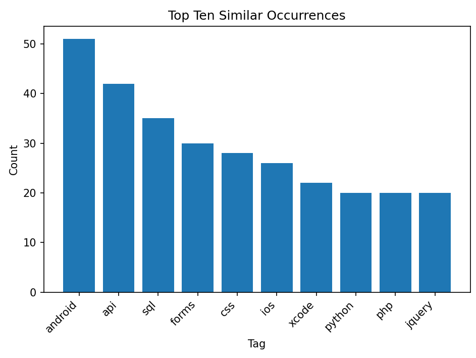

# Stack Overflow Tag Similarity Analyzer

This Python script analyzes Stack Overflow tags for similarity and creates a bar chart of the top ten most common similar tag groups. It uses the Stack Exchange API to fetch tag data and the `fuzzywuzzy` library to identify similar tags.

## Getting Started

1. Clone this repository to your local machine.
2. Make sure you have Python 3.x installed.
3. Install the required libraries.
4. Run the Python script

## How It Works

- The script fetches tag data from the Stack Exchange API.
- It groups similar tags using the `fuzzywuzzy` library.
- The top ten most common similar tag groups are displayed in a bar chart.

## Example Output

Below is an example of the bar chart generated by the script:

---
Created by [Brent Reynolds]
